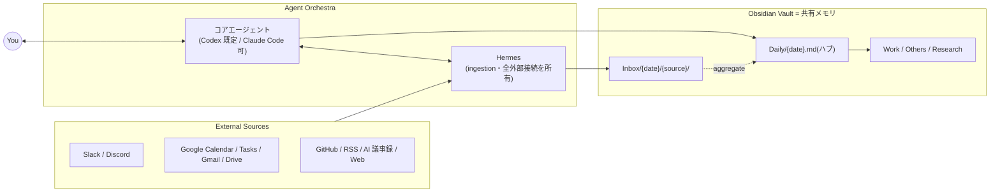

# Claudian Orchestra — Vault Template

> An Obsidian vault scaffold for running a **core AI agent (Codex by default, Claude Code selectable) + Hermes as a knowledge-base orchestra** on top of your second brain.
>
> プレーン Markdown の知識ベースを「人と AI の共有メモリ」にする — 設計と運用契約一式のテンプレート．

---

## これは何

**personal knowledge base（PKB）を「コアエージェント 1 体 + Hermes」で運用するための vault テンプレート**です．コアエージェントは **Codex（既定）または Claude Code**（使い始めに選択・併用も可）．**Markdown のフォルダ構造**・**エージェント契約（`AGENTS.md` = コア契約 / `CLAUDE.md` = Claude コア用アダプタ / `.hermes/`）**・**運用ルール（`.claude/rules/`）**・**スキル群（`.claude/skills/`）**・**ノートテンプレ（`Templates/`）** で構成されています．clone してそのまま Obsidian で開けば，自分の PKB として使い始められます．

- 設計思想: Karpathy の "LLM wiki"・Google の Open Knowledge Format（OKF）・PKM の Zettelkasten 伝統と整合
- フォーマット: **Just markdown / Just files / Just YAML frontmatter**（OKF 整合）．プラットフォーム非依存．

---

## アーキテクチャ概要



情報の流れは **capture → Daily ハブ → Main DB** の 3 段：

```
External Source
   │ ① capture（Hermes・拡張 only）
   ▼
Inbox/{YYYY-MM-DD}/{source}/{file}.md     ← 日付ファースト・auto-route なし
   │ ② aggregate（コアエージェントが当日中に Daily へ集約）
   ▼
Daily/{YYYY-MM-DD}.md                      ← その日の唯一のハブ
   │ ③ distribute（EOD に Main DB へ蒸留・配分）
   ▼
Work / Research / Others                   → Evergreen
```

詳細は [`AGENTS.md`](./AGENTS.md)（コア契約） / [`.claude/rules/`](./.claude/rules/) を参照．

---

## クイックスタート

> **初めての人はまず [`GETTING-STARTED.md`](./GETTING-STARTED.md) を読んでください。** 全部を一度にセットアップする必要はなく、Obsidian + コアエージェント CLI だけ(15分)→ コア確定(core-setup)→ Hermes → 外部接続 1 本ずつ、という段階式で始められます。外部接続(Slack / Google / GitHub 等)の個別手順とトラブルシューティングは [`docs/connections/`](./docs/connections/README.md) にあります。

### 1. clone してリネーム

```bash
git clone https://github.com/your-org/claudian-orchestra-template.git my-vault
cd my-vault
```

### 2. Obsidian で開く

`Open folder as vault` でこのディレクトリを選ぶ．`.obsidian/` に最小設定が入っているので、そのまま開けば vault として認識される．

### 3. エージェントを接続する

| Agent | 役割 | 必要なもの |
|---|---|---|
| **コアエージェント** | 対話・判断・実装・ノート編集のすべて | **Codex（既定）**：[Codex CLI](https://github.com/openai/codex)（ChatGPT サブスクリプション）／ **または Claude Code**：[Claude Code CLI](https://docs.claude.com/claude-code)（Anthropic アカウント）。使い始めに `core-setup` で選択（併用も可・[`AGENTS.md`](./AGENTS.md) §0） |
| **Hermes** | ingestion（全外部接続の所有） | [Hermes Agent](https://github.com/NousResearch/Hermes-Agent)（Slack / Google / GitHub の認証） |

Hermes は任意です．Slack / Calendar / Tasks の自動取り込みを使わないなら **コアエージェントだけ**で十分動きます．その場合は `Inbox/` への投入を全部手動でやることになります．

外部接続の繋ぎ込みは PKM 最大の躓きポイントなので，**自分の使うツールを選んで，選んだものだけ**をガイド付きで繋げる仕組みを用意しています：

- **対話式セットアップ（推奨）**：コアエージェントに「**接続セットアップして**」と言えば [`connection-setup`](./.claude/skills/connection-setup/SKILL.md) skill がユースケースを質問し，使うツールだけを [`connections.yaml`](./.claude/connections.yaml) に記録して 1 本ずつセットアップします．使わないツールはジョブリストからも消えます
- 段階式セットアップ：[`GETTING-STARTED.md`](./GETTING-STARTED.md)（Level 0〜3）
- 接続別ガイド：[`docs/connections/`](./docs/connections/README.md)（GitHub / Google カレンダー・Tasks / Gmail / Google Drive / Slack / Discord / RSS / クリッピング / AI 議事録 / Zotero / Notion。カタログ外ツールの対応表つき）
- 診断：コアエージェントに「**接続チェックして**」と言えば [`connection-doctor`](./.claude/skills/connection-doctor/SKILL.md) skill がどこが繋がっていてどこが切れているかを表で報告します

### 4. 自分用に整える

- `Work/PROJ_A/` を実際の案件コード（例：`Work/MYCLIENT/`）にリネーム．`.claude/rules/work-management.md` の対応表も更新．
- `Persona/AGENTS.md` に自分のプロフィールを書く（vault 全体から参照される identity の単一の正）．
- `Maps/Home.md` に自分の vault の入口を書く．
- 不要な skill は `.claude/skills/` から削除して構わない（特に `.hermes/skills/vault-capture/` 配下の外部接続は，使うものだけ残す）．

---

## 何が入っているか

| パス | 中身 |
|---|---|
| [`GETTING-STARTED.md`](./GETTING-STARTED.md) | 段階式セットアップガイド（Level 0〜3・初めての人はここから） |
| [`docs/connections/`](./docs/connections/) | 外部接続の個別セットアップガイド（GitHub / Google 系 / Slack / Discord / RSS / クリッピング / AI 議事録 / Zotero / Notion の 11 接続 + カタログ外対応表） |
| [`AGENTS.md`](./AGENTS.md) | **コア契約**（vault の最上位ルール。Codex が自動読込・Claude コアもここに従う） |
| [`CLAUDE.md`](./CLAUDE.md) | Claude Code をコアにする場合のアダプタ（AGENTS.md を指す） |
| [`.claude/rules/`](./.claude/rules/) | 運用ルール（frontmatter / tagging / Daily 運用 / Inbox routing / Work / Others 等） |
| [`.claude/skills/`](./.claude/skills/) | コア用 skill 群（core-setup / connection-setup / daily-briefing / aggregate-* / eod-distill など。トリガー時に SKILL.md を読んで従う） |
| [`.claude/agents/`](./.claude/agents/) | サブエージェント定義（general-purpose・Claude コア用） |
| [`.claude/docs/knowledges/`](./.claude/docs/knowledges/) | 運用で得た学びの structured knowledge base（テンプレでは README のみ） |
| [`.codex/`](./.codex/) | Codex 側の契約・skill 共有 |
| [`.hermes/`](./.hermes/) | Hermes 宣言的設定の雛形（`config.yaml`） + vault 用 capture skill（vault-capture/） |
| [`Templates/`](./Templates/) | ノートテンプレ（daily / weekly / work / idea / exploration / paper / experiment 等） |
| [`Maps/`](./Maps/) | 横断 MOC（Home / Code-Map / People-Map）＋ 5 ラベル Bases ビュー |
| [`Work/PROJ_A/`](./Work/PROJ_A/) | クライアント案件の 4 層標準構造（sources / docs / meetings / code / deliverables / proposals / references / logs） |
| [`Others/`](./Others/) | Ideas / Activities / Learning |
| [`Persona/`](./Persona/) | 著者プロフィールの単一の正（vault 全体から参照） |
| [`Inbox/`](./Inbox/) | 外部 capture の受け口（日付ファースト） |
| [`Daily/`](./Daily/) | デイリー / ウィークリージャーナル |
| [`Archive/`](./Archive/) | 非活性退避先 |
| [`Meta/`](./Meta/) | vault 自身についての作業（自己言及プロジェクト） |
| [`Research/`](./Research/) | 研究用プレースホルダ（必要なら git submodule で外部リポを mount） |

`.gitignore` は **secret は絶対に commit しない / runtime state は version しない** という方針で組まれています（特に `.hermes/skills/*` 配下は **vault-capture/ 以外を除外**するように設定済み）．

---

## 設計の思想（短く）

1. **Vault そのものがインターフェース**：人も AI も同じ Markdown を読み書きする．特定 SaaS にロックインされない．
2. **正本（system of record）の所在を決め切る**：会話=Slack / ToDo=GTasks / 予定=GCal / コード=GitHub / 記憶=この vault．重複保有しない．
3. **capture と curate を分ける**：Hermes は `Inbox/` に投げるだけ．判断と移動はコアエージェント＋人間．
4. **書き手は時点ごとに 1 人**：split-brain を避けるため，同じファイルを 2 体が同時に触らない．
5. **proposal → delivery を地続きに**：案件は `Work/{CODE}/` の中で提案フェーズもデリバリフェーズも 4 層標準で扱う．
6. **on-demand 既定**：Daily の `## 🤖 ジョブリスト` を見て人間が「これやって」と指示する．cron 多用しない．

---

## ライセンス

[MIT](./LICENSE)．scaffold は自由に改変・派生してください．

## 謝辞

- Andrej Karpathy — "LLM wiki / AI second brain"
- Google Cloud — Open Knowledge Format
- Andy Matuschak — Evergreen notes
- Nous Research — Hermes Agent

フィードバック・PR は歓迎です．
