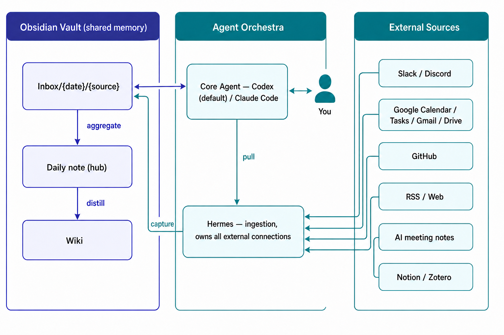

# Claudian Orchestra — Vault Template

> An Obsidian vault scaffold for running a **core AI agent (Codex CLI) + Hermes as a knowledge-base orchestra** on top of your second brain.
>
> プレーン Markdown の知識ベースを「人と AI の共有メモリ」にする — 設計と運用契約一式のテンプレート．

---

## これは何

**personal knowledge base（PKB）を「コアエージェント 1 体 + Hermes」で運用するための vault テンプレート**です．コアエージェントは **Codex CLI**．`AGENTS.md` が中核契約、`.codex/` が rules / skills / registry / docs の正本です．

- 設計思想: Karpathy の "LLM wiki"・Google の Open Knowledge Format（OKF）・PKM の Zettelkasten 伝統と整合
- フォーマット: **Just markdown / Just files / Just YAML frontmatter**（OKF 整合）．プラットフォーム非依存．

---

## アーキテクチャ概要



*Vault そのものを共有メモリに、コアエージェント（Codex）と Hermes がその上で協調する。External Sources → Hermes（capture）→ Inbox → Daily → Main DB の一方向フロー。*

情報の流れは **capture → Daily ハブ → Main DB** の 3 段：

```
External Source
   │ ① capture（Hermes・拡張 only）
   ▼
Inbox/{YYYY-MM-DD}/{source}/{file}.md     ← 日付ファースト・auto-route なし
   │ ② aggregate（コアエージェントが当日中に Daily へ集約）
   ▼
Daily/{YYYY-MM-DD}.md                      ← 唯一のハブ＝人間の監査点
   │ ③ distribute（EOD に Main DB へ蒸留・配分）
   ▼
Wiki                                       → Evergreen
```

詳細は [`AGENTS.md`](./AGENTS.md)（コア契約） / [`.codex/rules/`](./.codex/rules/) を参照．

---

## クイックスタート

> **初めての人はまず [`GETTING-STARTED.md`](./GETTING-STARTED.md) を読んでください。** 全部を一度にセットアップする必要はなく、Obsidian + Codex CLI だけ(15分)→ Hermes → 外部接続 1 本ずつ、という段階式で始められます。外部接続(Slack / Google / GitHub 等)の個別手順とトラブルシューティングは [`Meta/connections/`](./Meta/connections/README.md) にあります。

### 1. clone してリネーム

```bash
git clone https://github.com/your-org/claudian-orchestra-template.git my-vault
cd my-vault
```

### 2. Obsidian で開く

`Open folder as vault` でこのディレクトリを選ぶ．`.obsidian/` に最小設定が入っているので、そのまま開けば vault として認識される．

### 3. エージェントを接続する

| Agent | 役割 | 必要なもの |
|---|---|---|
| **コアエージェント** | 対話・判断・実装・ノート編集のすべて | **Codex**：[Codex CLI](https://github.com/openai/codex)（ChatGPT サブスクリプション）。契約は [`AGENTS.md`](./AGENTS.md) |
| **Hermes** | ingestion（全外部接続の所有） | [Hermes Agent](https://github.com/NousResearch/Hermes-Agent)（Slack / Google / GitHub の認証） |

Hermes は任意です．Slack / Calendar / Tasks の自動取り込みを使わないなら **コアエージェント + browser capture extension** で動きます．Inbox は extension が書き、コアは Daily 集約と curated note を担当します．

外部接続の繋ぎ込みは PKM 最大の躓きポイントなので，**自分の使うツールを選んで，選んだものだけ**をガイド付きで繋げる仕組みを用意しています：

- **対話式セットアップ（推奨）**：コアエージェントに「**接続セットアップして**」と言えば [`connection-setup`](./.codex/skills/connection-setup/SKILL.md) skill がユースケースを質問し，使うツールだけを [`connections.yaml`](./.codex/connections.yaml) に記録して 1 本ずつセットアップします．使わないツールはジョブリストからも消えます
- 段階式セットアップ：[`GETTING-STARTED.md`](./GETTING-STARTED.md)（Level 0〜2）
- 接続別ガイド：[`Meta/connections/`](./Meta/connections/README.md)（GitHub / Google カレンダー・Tasks / Gmail / Google Drive / Slack / Discord / RSS / クリッピング / AI 議事録 / Zotero / Notion。カタログ外ツールの対応表つき）
- 診断：コアエージェントに「**接続チェックして**」と言えば [`connection-doctor`](./.codex/skills/connection-doctor/SKILL.md) skill がどこが繋がっていてどこが切れているかを表で報告します

### 4. 自分用に整える

- `Wiki/` に最初のノートを 1 枚書いてみる．
- `Persona/AGENTS.md` に自分のプロフィールを書く（vault 全体から参照される identity の単一の正）．
- `Maps/Home.md` に自分の vault の入口を書く．
- 不要な skill は `.codex/skills/` から削除して構わない（特に `.hermes/skills/vault-capture/` 配下の外部接続は，使うものだけ残す）．

---

## 何が入っているか

| パス | 中身 |
|---|---|
| [`GETTING-STARTED.md`](./GETTING-STARTED.md) | 段階式セットアップガイド（Level 0〜2・初めての人はここから） |
| [`Meta/connections/`](./Meta/connections/) | 外部接続の個別セットアップガイド（GitHub / Google 系 / Slack / Discord / RSS / クリッピング / AI 議事録 / Zotero / Notion の 11 接続 + カタログ外対応表） |
| [`AGENTS.md`](./AGENTS.md) | **コア契約**（vault の最上位ルール。Codex が自動読込） |
| [`.codex/rules/`](./.codex/rules/) | 運用ルール（frontmatter / tagging / Daily 運用 / Inbox routing / Wiki 等） |
| [`.codex/skills/`](./.codex/skills/) | コア用 skill の正本（daily-briefing / inbox-aggregate / eod-distill / connection-setup 等） |
| [`.codex/connections.yaml`](./.codex/connections.yaml) | 接続レジストリ（使うツールの single source of truth） |
| [`.codex/docs/knowledges/`](./.codex/docs/knowledges/) | 運用で得た学びの structured knowledge base（テンプレでは README のみ） |
| [`.codex/config.toml`](./.codex/config.toml) | 最小限の Codex 固有設定。モデル・権限・sandbox は利用者設定 |
| [`.hermes/`](./.hermes/) | Hermes 宣言的設定の雛形（`config.yaml`） + vault 用 capture skill（vault-capture/） |
| [`Templates/`](./Templates/) | ノートテンプレ（daily / weekly / meeting / idea / exploration / paper / experiment / code-note 等） |
| [`Maps/`](./Maps/) | 横断 MOC（Home / Code-Map / People-Map）＋ 5 ラベル Bases ビュー |
| [`Wiki/`](./Wiki/) | 汎用ナレッジの Main DB（アイデア / 学習・読書 / 文献・実験ノート / 活動記録） |
| [`Persona/`](./Persona/) | 著者プロフィールの単一の正（vault 全体から参照） |
| [`Inbox/`](./Inbox/) | 外部 capture の受け口（日付ファースト） |
| [`Daily/`](./Daily/) | デイリー / ウィークリージャーナル |
| [`Archive/`](./Archive/) | 非活性退避先 |
| [`Meta/`](./Meta/) | vault 自身についての作業（自己言及プロジェクト） |

`.gitignore` は **secret は絶対に commit しない / runtime state は version しない** という方針で組まれています（特に `.hermes/skills/*` 配下は **vault-capture/ 以外を除外**するように設定済み）．

---

## 設計の思想（短く）

1. **Vault そのものがインターフェース**：人も AI も同じ Markdown を読み書きする．特定 SaaS にロックインされない．
2. **正本（system of record）の所在を決め切る**：会話=Slack / ToDo=GTasks / 予定=GCal / コード=GitHub / 記憶=この vault．重複保有しない．
3. **capture と curate を分ける**：Hermes は `Inbox/` に投げるだけ．判断と移動はコアエージェント＋人間．
4. **Daily = 人間の監査点**：エージェントの全アクション（取り込み・集約・蒸留・チェック）は Daily に痕跡が残る．人はその日の Daily を読むだけで，何が入り・どこへ蒸留されたかを監査・承認できる．
5. **書き手は時点ごとに 1 人**：split-brain を避けるため，同じファイルを 2 体が同時に触らない．
6. **on-demand 既定**：Daily の `## 🤖 ジョブリスト` を見て人間が「これやって」と指示する．新規 cron は登録せず、既存 legacy job だけ過渡期維持．

---

## ライセンス

[MIT](./LICENSE)．scaffold は自由に改変・派生してください．

## 謝辞

- Andrej Karpathy — "LLM wiki / AI second brain"
- Google Cloud — Open Knowledge Format
- Andy Matuschak — Evergreen notes
- Nous Research — Hermes Agent

フィードバック・PR は歓迎です．
